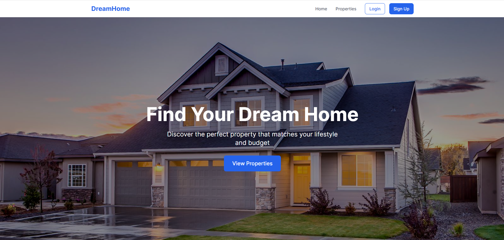
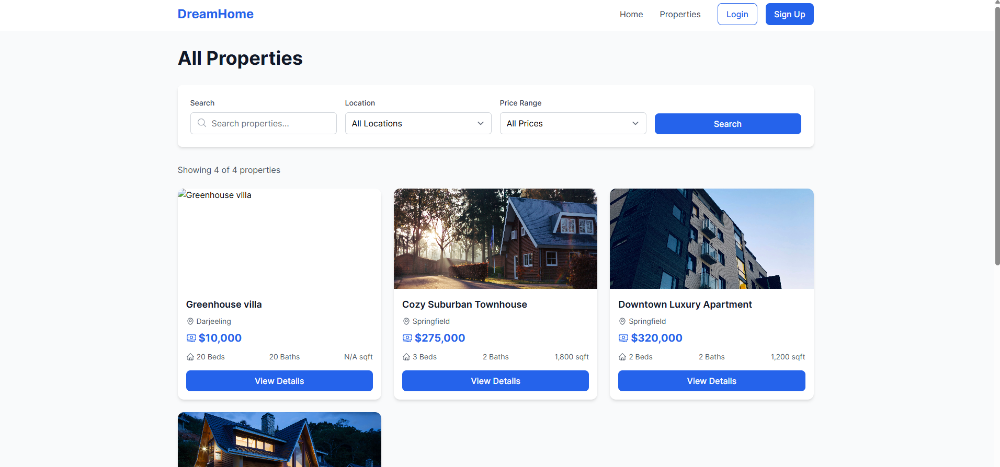
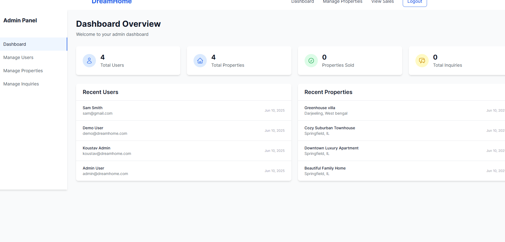
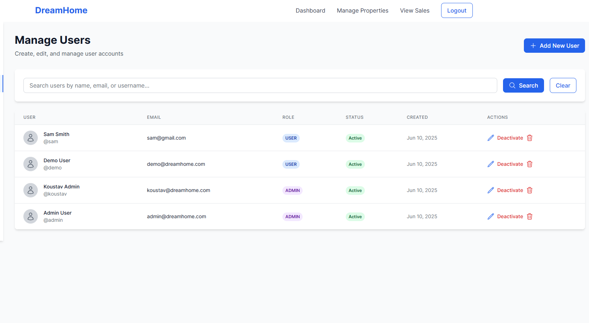
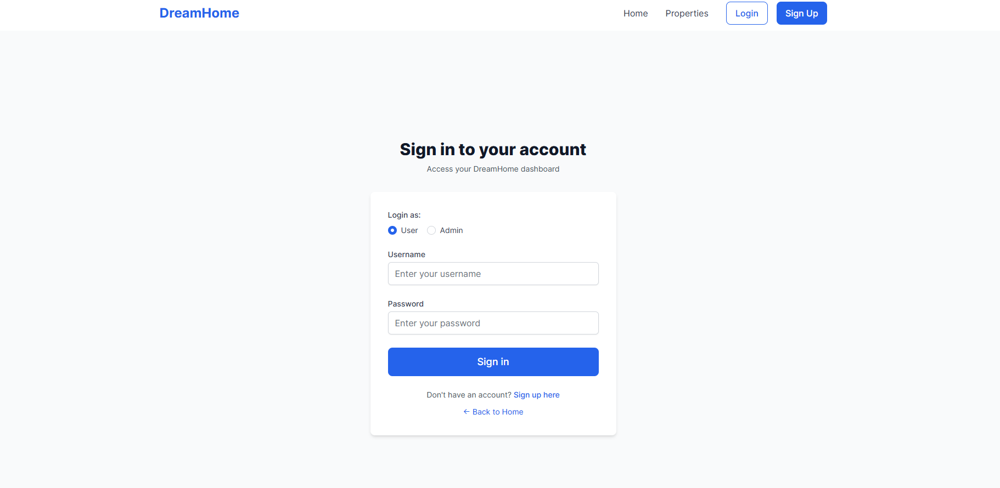
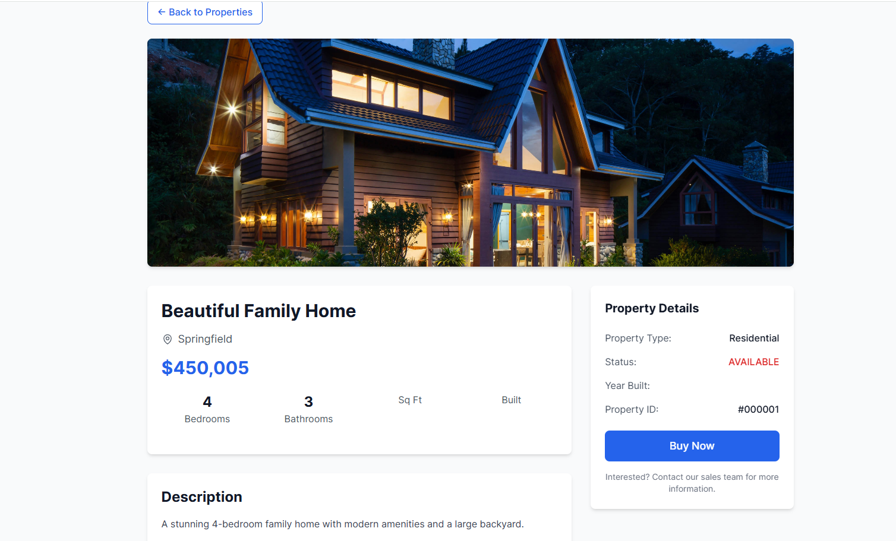
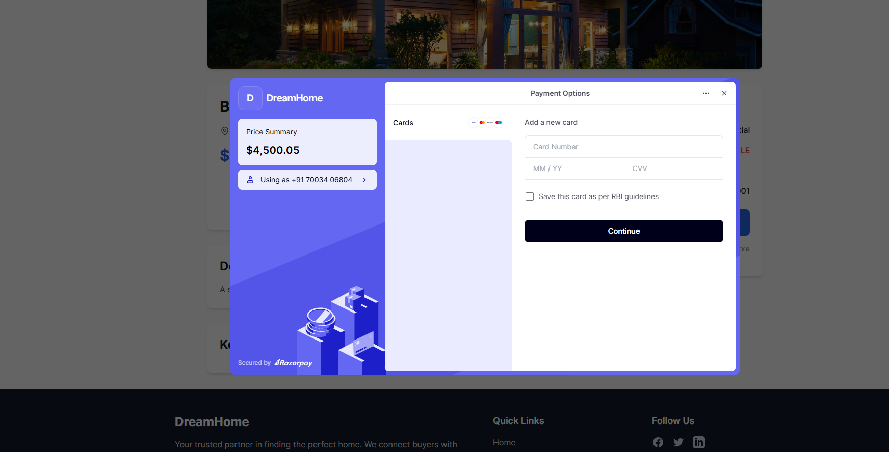

# 🏡 DreamHome Real Estate Platform

A full-stack real estate management system designed for users to explore and inquire about properties, and for admins to manage users, properties, and inquiries with ease.

---
##Screenshots









## 🔧 Tech Stack

### Backend

* **Java 17**
* **Spring Boot 3.2**
* **Spring Security** (JWT-based authentication)
* **Spring Data JPA**
* **MySQL**
* **Maven**

### Frontend

* **React.js**
* **Vite**
* **Tailwind CSS**
* **React Router**
* **Axios**

---

## ✨ Key Features

### 👥 Authentication & Authorization

* Secure JWT-based login & registration
* Role-based access control (USER / ADMIN)
* Encrypted passwords using BCrypt

### 🏘️ Property Management

* CRUD operations for properties
* Search, filter, and view properties
* Manage property status and featured listing
* Multiple image URL support

### 👤 User Management

* Admin panel to manage users
* Create, update, delete, activate/deactivate users
* User profiles and dashboard insights

### 📩 Inquiry System

* Users can send inquiries for properties
* Admin can respond and update status
* Inquiry tracking and dashboard metrics

### 📊 Admin Dashboard

* Stats: total users, properties, inquiries
* View recent activity
* Manage everything via sidebar navigation

---

## 📂 Project Structure

```
dreamhome/
├── backend/                     # Spring Boot application
│   ├── src/main/java/com/...   # Controllers, Services, Entities
│   └── application.yml         # Environment configs
└── frontend/                   # React + Vite app
    ├── src/
    │   ├── components/
    │   ├── pages/
    │   └── api/                # Axios services
    └── vite.config.js
```

---

## 🚀 Getting Started

### 📁 Clone the Project

```bash
git clone https://github.com/your-username/dreamhome-platform.git
cd dreamhome-platform
```

---

## ⚙️ Backend Setup (Spring Boot)

### 📌 Prerequisites

* Java 17+
* Maven
* MySQL 8+

### 🔧 Configuration

Update `backend/src/main/resources/application.yml`:

```yaml
spring:
  datasource:
    url: jdbc:mysql://localhost:3306/dreamhome_db
    username: your_mysql_username
    password: your_mysql_password

jwt:
  secret: your_jwt_secret
  expiration: 86400000
```

### 🧪 Run the Application

```bash
cd backend
mvn spring-boot:run
```

API will be available at: `http://localhost:8080/api`

---

## 💻 Frontend Setup (React + Vite)

### 📌 Prerequisites

* Node.js 18+
* npm or yarn

### 🧪 Run the Application

```bash
cd frontend
npm install
npm run dev
```

Frontend runs at: `http://localhost:5173`

---

## 🔐 Admin Access (Default)

* **Username**: `koustav`
* **Password**: `koustav123`

---

## 📑 REST API Overview

### Auth

| Method | Endpoint             | Description       |
| ------ | -------------------- | ----------------- |
| POST   | `/api/auth/login`    | Login with JWT    |
| POST   | `/api/auth/register` | Register new user |

### Properties (Public)

| Method | Endpoint                   | Description                   |
| ------ | -------------------------- | ----------------------------- |
| GET    | `/api/properties/public`   | List all available properties |
| GET    | `/api/properties/{id}`     | Property details              |
| GET    | `/api/properties/featured` | Featured properties           |
| GET    | `/api/properties/search`   | Search properties by keyword  |
| GET    | `/api/properties/filter`   | Filter by price/type/status   |

### Properties (Admin)

| Method | Endpoint                            | Description         |
| ------ | ----------------------------------- | ------------------- |
| GET    | `/api/properties/admin/all`         | List all properties |
| POST   | `/api/properties/admin`             | Create property     |
| PUT    | `/api/properties/admin/{id}`        | Update property     |
| DELETE | `/api/properties/admin/{id}`        | Delete property     |
| PUT    | `/api/properties/admin/{id}/status` | Update status       |

### Users (Admin)

| Method | Endpoint                            | Description               |
| ------ | ----------------------------------- | ------------------------- |
| GET    | `/api/admin/users`                  | Get users with pagination |
| POST   | `/api/admin/users`                  | Create new user           |
| PUT    | `/api/admin/users/{id}`             | Edit user                 |
| DELETE | `/api/admin/users/{id}`             | Delete user               |
| PUT    | `/api/admin/users/{id}/activate`    | Activate user             |
| PUT    | `/api/admin/users/{id}/deactivate`  | Deactivate user           |
| GET    | `/api/admin/users/search?query=xyz` | Search users              |

### Inquiries (Admin)

| Method | Endpoint                            | Description        |
| ------ | ----------------------------------- | ------------------ |
| GET    | `/api/admin/inquiries`              | List all inquiries |
| PUT    | `/api/admin/inquiries/{id}/respond` | Respond to inquiry |

---

## 🧪 Testing Guide

* Run unit tests: `mvn test`
* Verify API response via Postman
* Test role-based access restrictions
* Check token expiration and validation

---

## 🔒 Security Highlights

* JWT token-based stateless authentication
* Password hashing with BCrypt
* Role-based access restrictions
* CORS configuration
* CSRF protection enabled (if required)

---

## 🛠 Deployment

### Backend

```bash
cd backend
mvn clean package
java -jar target/dreamhome-backend-0.0.1-SNAPSHOT.jar
```

### Frontend

```bash
cd frontend
npm run build
# Deploy dist/ folder to your hosting service
```

---

## ✅ Checklist Before Production

* [ ] Secure environment variables & secrets
* [ ] Setup production DB with proper access
* [ ] Use HTTPS with domain
* [ ] Monitor backend logs and error responses
* [ ] Enable logging and rate limiting
* [ ] Optimize image load (CDN or lazy load)

---

## 📬 Contact

For any queries or contributions, reach out at:

* ✉️ Email: `sumitadhikari166@gmail.com`
* 🔗 LinkedIn: [Sumit Adhikari](https://www.linkedin.com/in/sad2004)

---

> “Build your dream home, virtually.”

